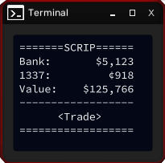

# SCRIP

A tiny `1337coin` trading widget for the game Grey Hack.

Checking your bank account and looking after your savings can be cumbersome.

`SCRIP` allows you to handle your finances as conveniently as possible, without compromising your safety.




<details>
  <summary>Table of Contents</summary>
  <ol>
    <li><a href="#features">Features</a></li>
    <li><a href="#what-is-1337coin">What is 1337coin?</a></li>
    <li><a href="#before-you-start-staying-safe">Before You Start: Staying Safe</a></li>
    <li><a href="#installation">Installation</a></li>
    <li>
      <a href="#usage">Usage</a>
      <ul>
        <li><a href="#keybinds">Keybinds</a></li>
        <li><a href="#trading-mode-keybinds">Trading mode keybinds</a></li>
      </ul>
    </li>
    <li>
      <a href="#security-features">Security features</a>
      <ul>
        <li><a href="#global-password-verification">Global Password Verification</a></li>
        <li><a href="#global-cap-on-login-attempts">Global Cap on Login Attempts</a></li>
        <li><a href="#ip-address-whitelisting">IP Address Whitelisting</a></li>
      </ul>
    </li>
    <li><a href="#how-it-works">How It Works</a></li>
    <li><a href="#license">License</a></li>
  </ol>
</details>


## Features

- Tiny! It fits the smallest window size
- Live monitoring of your bank and `1337coin` balances
- Fast and easy `1337coin` trading
- Automatic trading: when this mode is active, `SCRIP` keeps $1000 in your bank (configurable) and keeps buying `1337coin`s with any leftover cash
- Pending trade detection and manual cancellation
- Open `credi7` button (for changing the bank state)
- Wallet PIN button
- Intuitive, configurable hotkeys
- Advanced security features

## What is 1337coin?
`1337coin` is a crypto stablecoin available on multiplayer, created and managed by Plu70. His hard work allows players to use his coin as a safe haven, we're all very grateful! <3

You can get it here: [https://discord.gg/VuWYdWUXQw]

## Before You Start: Staying Safe
`SCRIP` uses your wallet credentials and 1337coin username to work. User safety is very important to me, and I have implemented [strict security features.](#security)

If you want an extra layer of security, leave some or all of these credentials as `null` in the code: you will be prompted to type them at runtime. Or you can choose a master password to login, instead. I recommend something [long and easy to remember.](https://xkcd.com/936/)

**IMPORTANT:** if you choose to hardcode any credentials, **do not import the code with `greybel-vs`**. The source code would be visible in your machine for a split second, enough for a malicious actor to grab it. And of course, **do not save the source code** in your in-game computer either.

## Installation

1. Download `scrip.src`, but don't import it into the game yet.
2. Register a new coin. It should not be used for anything other than for `SCRIP`.
3. Hardcode the coin's credentials in the `// Credentials` section of the script.
4. Create a new username and password for a subwallet and hardcode them, `SCRIP` will create a subwallet for you.
5. (Recommended) Also hardcode your wallet's credentials and 1337coin username, as well as a master password. If you skip this step, you will have to enter your credentials at runtime.
6. Review the rest of the settings.
7. Import and compile the script in-game.

## Usage
`SCRIP` requires a working internet connection, and doesn't need elevated permissions to run.

When you launch the script, you will see a popup with your coin's name. **Make sure it's there and spelled correctly every time before entering your credentials.**

After entering your credentials, you should see the main screen, which is updated every few seconds. You can then press `D` to start trading, `X` to cancel, or `E` to confirm the trade. Alternatively, press `A` to auto trade.

A trade in angle brackets like \<+¢1 -$137\> is not confirmed yet, you can change the amount by using `WASD`.

A trade in parentheses like (+¢1 -$137) is confirmed but pending. If it seems stuck like that, you should change the `1337coin` bank state through `credi7` by pressing `C`.

### Keybinds
| Key | Command             |
| --- | ------------------- |
| `W` | Buy all             |
| `A` | Auto trade          |
| `S` | Sell all            |
| `D` | Manual trade        |
||
| `E` | Confirm             |
| `X` | Cancel              |
| `Q` | Quit                |
||
| `C` | Open `credi7`       |
| `P` | Show wallet PIN     |
| `H` | Heartbeat toggle    |
| `L` | Password manager    |

### Trading mode keybinds

| Key   | Command                         |
| ----- | ------------------------------- |
| `A/D` | Increase / decrease trade by 1  |
| `W/S` | Increase / decrease trade by 10 |


All keybinds are configurable in the `// Keybinds` section of the script.

## Security features
### Global Password Verification
This script periodically verifies the hardcoded SCRIP password against the custom coin's subwallet_info. This allows you to change the password globally, which useful if you suspect that someone stole your SCRIP binary. If you change the password in subwallet_info AND recompile the script with the new password, the stolen binary will refuse to launch, and will close if already running. This feature only verifies the main SCRIP password.

### Global Cap on Login Attempts
Using a similar mechanism as above, SCRIP keeps track of unsuccessful login attempts to prevent bruteforcing attacks. If your program hits this cap unexpectedly, it means someone stole your copy of SCRIP and is trying to login. Don't panic, they should be locked out of the program, just like you are. I highly recommend checking your system's security, and then changing your password to prevent further disruptions.

If you triggered the cap yourself, just follow the instructions to verify your credentials and reset the cap. I recommend changing the SCRIP password too, just in case.

### IP Address Whitelisting
An optional feature that allows you to whitelist a list of IP addresses; if an instance starts from a different address, it will shut itself down.

## How It Works
`SCRIP`'s main innovation is the ability to check your bank balance via script.

This is achieved by testing whether you have enough money to fund an arbitrary buy order using a custom coin:

```javascript
// Returns true if bank_balance > coins * rate, aka if a purchase could be made
testBalance = function(wallet, coins, rate)
    success = wallet.buy_coin(COIN_NAME, coins, rate, COIN_SW_USR)
    return success[:48] != "Purchase failed: Insufficient money in the bank."
end function
```

Using this test, we can start a binary search to efficiently find the exact balance, see `getBankBalance()`.

Well... almost exact.

The game imposes limits on the amount of coins and their exchange rate for a single trade:
```javascript
coins <= 50000
rate  <= 10000
```

This stops us from calculating the exact balance if it is above $500 million (that shouldn't be an issue lol), but more importantly it forces us to increase the `rate` above 1 for balances above $50k, which means an unavoidable loss in precision.

The implementation I came up with has these error rates:

| Bank Balance     | Uncertainty | Example       |
|------------------|-------------|---------------|
| \$0 - $50k       | $0          | $5,555        |
| $50k - $500k     | < $10       | $55,550       |
| $500k - $5mil    | < $100      | $555,500      |
| $5mil - $50mil   | < $1,000    | $5,555,000    |
| $50mil - $500mil | < $10,000   | $55,550,000   |
| > $500mil        | > $0        | >$500,000,000 |

Of course, this table only affect the bank balance. The value of your crypto can be arbitrarily high with no precision loss, and that's where most of your savings should be anyway.

It is technically possible to achieve a much higher precision by executing a more thorough search. For example you could test a balance of $50,421 by figuring out that `50421 = 147 * 343` and `50,422 = 34 * 1483`, but for my use case such an algorithm would be both too complicated to design and not worth the compute time. And even this approach wouldn't be able to eliminate all uncertainties: consider prime numbers > 50,000 as an example.

If you implement something like this, please let me know, I'd love to see what it looks like.

## License

Distributed under the MIT License. See `LICENSE.txt` for more information.
